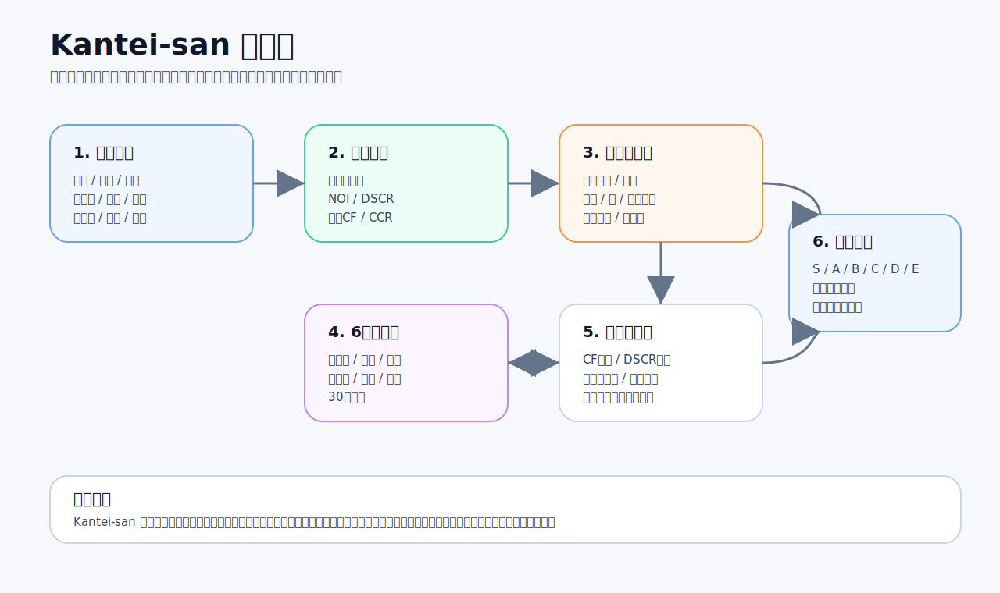
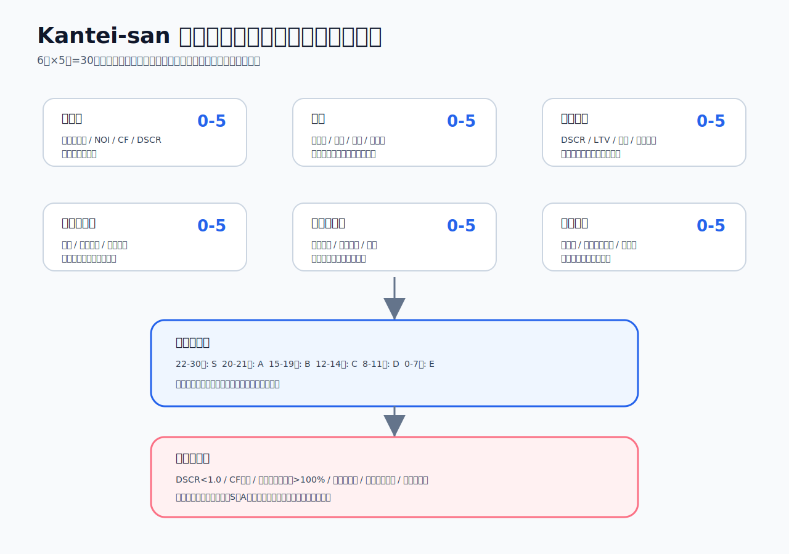
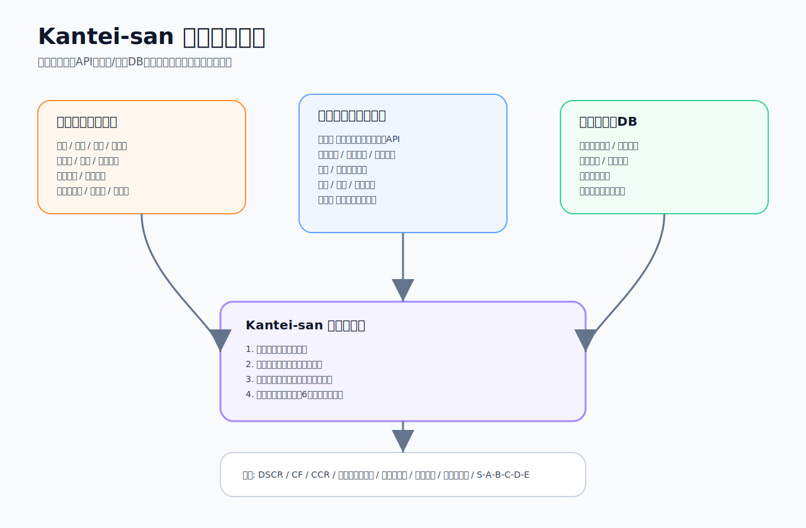
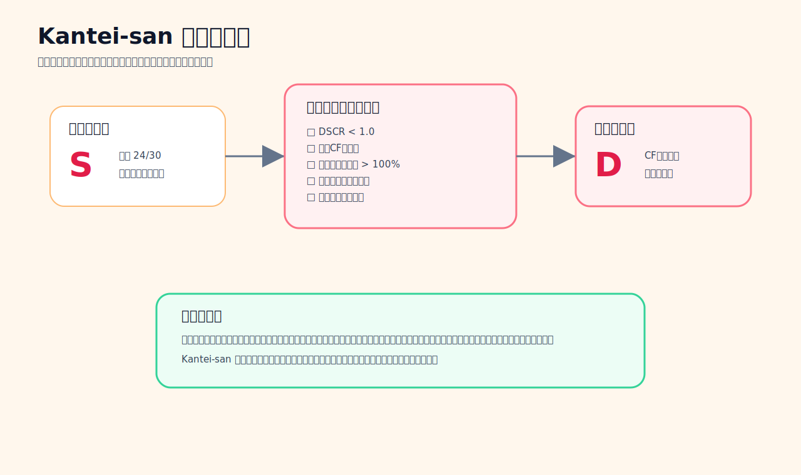
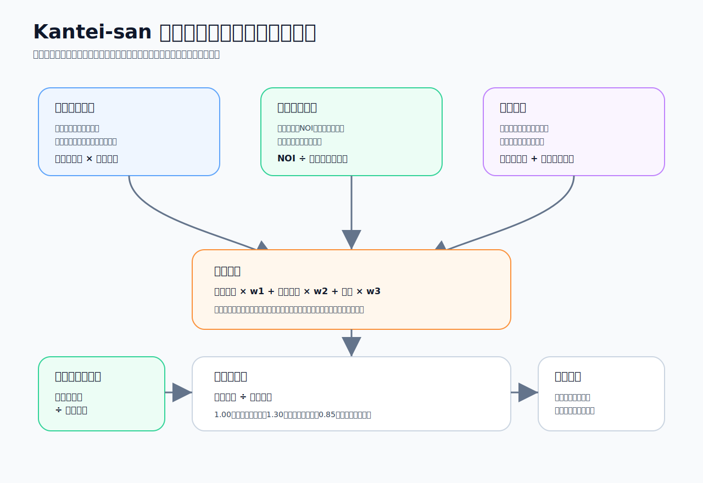

# Kantei-san ドキュメント索引

このフォルダは、収益不動産投資判定ロジックを **Kantei-san** という名前で整理した要件定義・投資条件・データ取得仕様・図解です。

> Kantei-san は、収益不動産を「なんとなく良さそう」ではなく、収支・融資・リスク・出口の観点から定量的に見るためのスクリーニングロジックです。最終的な投資判断を代替するものではなく、現地調査、賃貸需要調査、法務・税務・融資確認の前段階で使う初期判定ツールです。

## 1. まず読む資料

- [Kantei-san 要件定義書](requirements.md)
- [Kantei-san 投資条件・判定基準詳細](investment-conditions.md)
- [Kantei-san データ取得・情報ソース仕様](data-and-api.md)

## 2. 図解

### 全体像

### スコアリング・ランク判定フロー

### データ取得元

### ランクゲート判定

### 価格妥当性と土地値カバー率

## 3. この資料で決めていること

- どの入力項目が必要か
- 入力値をどこから取得するか
- 収支指標をどう計算するか
- 6軸スコアをどう採点するか
- S / A / B / C / D / E をどう判定するか
- 価格妥当性をどう見るか
- 土地値カバー率をどう計算するか
- 初心者が見ても意味がわかるよう、各指標を何のために使うか

## 4. 注意事項

- 本資料は、公開情報から推定したロジックと、不動産投資で一般的に使う指標を組み合わせた要件定義です。
- 元サービスの非公開ソースコードを複製したものではありません。
- 不動産投資には元本毀損、空室、修繕、災害、流動性、融資、税務、法務のリスクがあります。
- Kantei-san の判定は投資助言ではなく、初期スクリーニングです。
